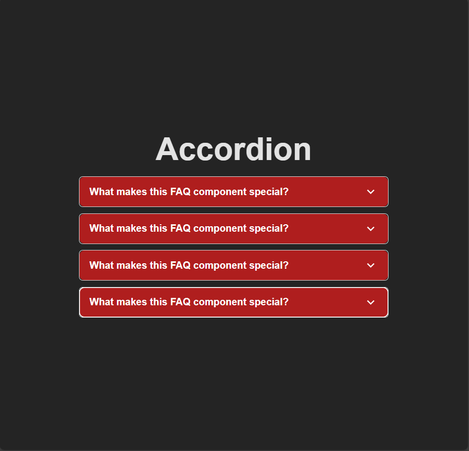

# Accordion Component

A modern, responsive accordion component built with React and Vite. This project demonstrates a clean FAQ-style accordion with smooth animations and intuitive user interactions.

## Screenshots


## Features

- 🔽 Expandable/collapsible accordion items
- ✨ Smooth transition animations
- 📱 Responsive design (works on all screen sizes)
- 🎨 Clean and modern UI
- 🔧 Easy to customize

## Tech Stack

- **React** - UI library
- **Vite** - Build tool
- **Material UI Icons** - Icon library

## Getting Started

### Prerequisites

Make sure you have Node.js installed on your machine.

### Installation

1. Clone the repository:
```
bash
git clone <repository-url>
```

2. Navigate to the project directory:
```
bash
cd Accordian
```

3. Install dependencies:
```
bash
npm install
```

### Running the Project

Start the development server:
```
bash
npm run dev
```

Open your browser and visit `http://localhost:5173` to see the accordion in action.

### Building for Production

To create a production build:
```
bash
npm run build
```

## Project Structure

```
├── src/
│   ├── components/
│   │   └── Accordian.jsx    # Main accordion component
│   ├── data/
│   │   └── Data.js          # Sample data for accordion items
│   ├── App.jsx              # Main application component
│   ├── App.css              # Application styles
│   ├── index.css            # Global styles
│   └── main.jsx             # Entry point
├── public/
│   └── ss.png               # Screenshot placeholder
├── index.html
├── package.json
├── vite.config.js
└── README.md
```

## Usage

The accordion component accepts a `data` prop with an array of objects:

```
jsx
const data = [
  {
    title: "Question 1",
    content: "Answer 1"
  },
  {
    title: "Question 2", 
    content: "Answer 2"
  }
];

<Accordian data={data} />
```

Each object should have:
- `title`: The question or header text
- `content`: The expanded content/answer


## License

MIT License
